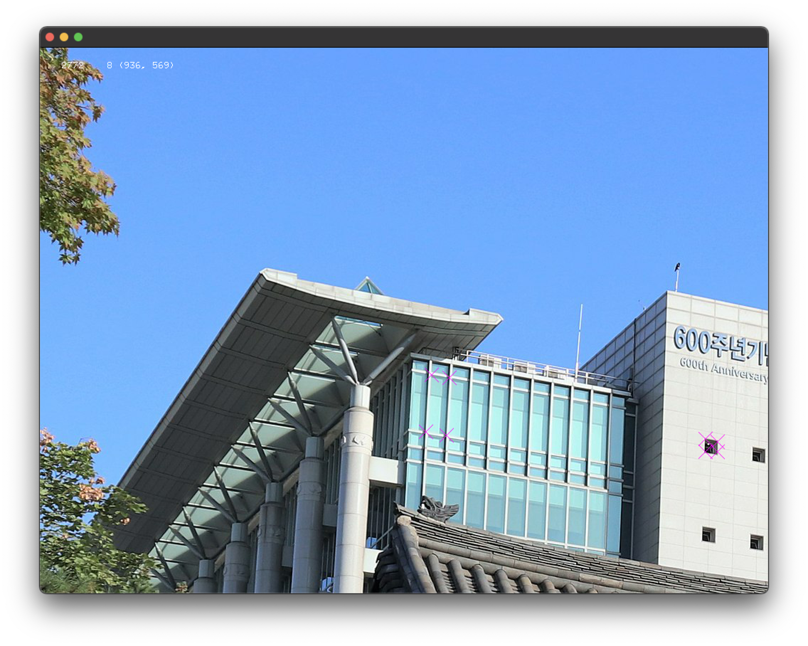

# About emptyExample

### Tested
* openFrameworks version : 0.11.2

### Learning Objectives

This example is the simplest possible openFrameworks app! 

* Loading & displaying an image.
* Using the std::vector
* Writing the vector to the file
* That's it. 
