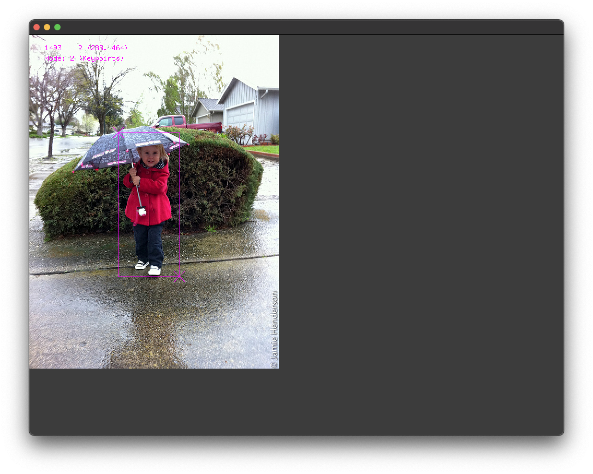
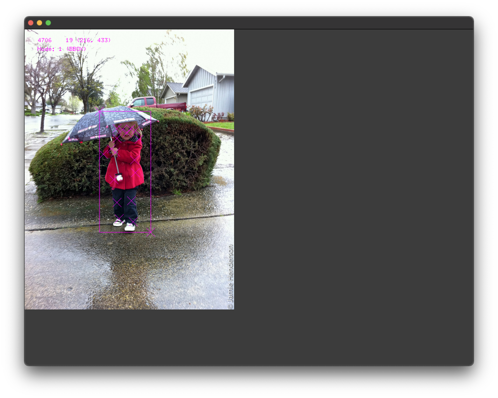

# About Application

### Tested
* openFrameworks version : 0.11.2 under macOS 12.1 Monterey

### Dependencies
* ofxJsonUtils, https://github.com/2bbb/ofxJsonUtils

### Usage

<kbd>1</kbd> Bounding box (bbox) mode <br/>
<kbd>2</kbd> Keypoint mode <br/>
<kbd>backspace</kbd> Remove the last point <br/>

<kbd>j</kbd> Save into a JSON file <br/>
<kbd>s</kbd> Save into a txt file (just use point information)<br/>

### Run Example

```
Mode:1 (178 , 206) Button (0) ---  1
Mode:1 (277 , 462) Button (0) ---  2
Mode:2 (233 , 239) Button (0) ---  3
Mode:2 (242 , 227) Button (0) ---  4
Mode:2 (224 , 227) Button (0) ---  5
Mode:2 (255 , 229) Button (0) ---  6
Mode:2 (211 , 227) Button (0) ---  7
Mode:2 (264 , 263) Button (0) ---  8
Mode:2 (251 , 292) Button (0) ---  9
Mode:2 (210 , 284) Button (0) ---  10
Mode:2 (207 , 257) Button (0) ---  11
Mode:2 (183 , 286) Button (0) ---  12
Mode:2 (195 , 272) Button (0) ---  13
Mode:2 (249 , 330) Button (0) ---  14
Mode:2 (240 , 378) Button (0) ---  15
Mode:2 (244 , 445) Button (0) ---  16
Mode:2 (204 , 325) Button (0) ---  17
Mode:2 (204 , 373) Button (0) ---  18
Mode:2 (212 , 431) Button (0) ---  19
Saving...into JSON
Preparation done !
1 1
Done... writing information into COCO/000000007088.json
```


### JSON example
```
{
    "H0": {
        "bbox": [
            178,
            206,
            277,
            462
        ],
        "keypoints": [
            233,
            239,
            1,
            242,
            227,
            1,
            224,
            227,
            1,
            255,
            229,
            ...
```
 <br/>



# TODOs
* Use right click to handle the invisible points
* json 처리시 하다가만 포인트들 무시
