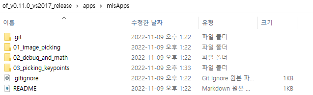

# Introduction
2022년 학생 여름워크샵 자료

# Setup

```
OF_HOME/apps/mlsApps 를 만들고 root로 설정
```
## 예시



# Index
## 01_image_picking
* std::vector
* openFrameworks 입문

## 02_debug_and_math
* 디버깅해보기
* quaternion 을 이용한 벡터간 회전 matrix 찾기

## 03_picking_keypoints
* Human Anatomical Keypoint 및 Bounding box 태깅 예시